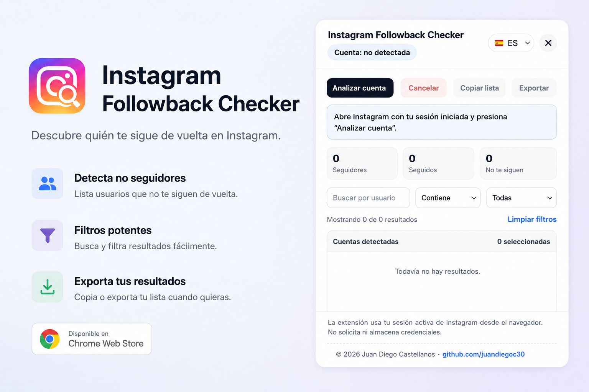

# Instagram Followback Checker

Extensión local para Chrome/Edge que analiza la cuenta autenticada de Instagram y muestra qué cuentas sigues que no te siguen de vuelta.

> 🌐 Also available in [English](README.md)

## Funciones

- Detección automática de la cuenta autenticada.
- Interfaz bilingüe: español e inglés.
- Selector de idioma con bandera: 🇪🇸 ES / 🇺🇸 EN.
- Persistencia del idioma elegido con `chrome.storage.local`.
- Conteo de seguidores, seguidos y cuentas que no siguen de vuelta.
- Filtros por texto, coincidencia y tipo de cuenta.
- Selección general e individual con checkbox.
- Exportación en CSV y JSON.
- Copia de lista al portapapeles.
- Dejar de seguir cuentas seleccionadas con pausas automáticas.

## Instalación local

1. Descomprime el proyecto.
2. Abre `chrome://extensions/` o `edge://extensions/`.
3. Activa el **Modo desarrollador**.
4. Haz clic en **Cargar descomprimida**.
5. Elige la carpeta del proyecto.
6. Abre `https://www.instagram.com/` con tu sesión iniciada.
7. Haz clic en el ícono de la extensión.

## Uso

1. Abre Instagram Web con tu sesión iniciada.
2. Haz clic en el ícono de la extensión.
3. Selecciona el idioma con el selector de bandera si lo deseas.
4. Presiona **Analizar mi cuenta**.
5. Revisa las cuentas que no te siguen de vuelta.
6. Usa los filtros para buscar por usuario, nombre, verificación o privacidad.
7. Desmarca las cuentas que no quieras dejar de seguir.
8. Presiona **Dejar de seguir seleccionadas** para ejecutar la acción.

El idioma se detecta automáticamente según el navegador. Si el navegador está en español, se inicia en español. Para otros idiomas, se inicia en inglés.

## Funcionamiento técnico

### Arquitectura

La extensión está construida sobre **Manifest V3** y consta de dos scripts:

| Archivo | Rol |
|---|---|
| `src/background.js` | Service worker. Escucha los clics en el ícono de la barra de herramientas e inyecta `content.js` en la pestaña activa de Instagram si aún no está cargado. Envía un mensaje para mostrar u ocultar el panel. |
| `src/content.js` | Se ejecuta dentro de la pestaña de Instagram. Construye y gestiona todo el panel de interfaz, realiza las llamadas a la API y contiene toda la lógica. |

### Permisos

| Permiso | Propósito |
|---|---|
| `activeTab` | Acceder a la pestaña activa de Instagram |
| `scripting` | Inyectar `content.js` bajo demanda al hacer clic en el ícono |
| `storage` | Persistir la preferencia de idioma con `chrome.storage.local` |

### Llamadas a la API

Todas las solicitudes van a la API REST interna de Instagram en `https://www.instagram.com/api/v1` y reutilizan las cookies de sesión activa del navegador (`credentials: 'include'`). No se usa ningún flujo OAuth ni se requiere contraseña.

| Endpoint | Método | Propósito |
|---|---|---|
| `/accounts/edit/web_form_data/` | GET | Detectar el nombre de usuario e ID del usuario autenticado en la sesión activa |
| `/users/web_profile_info/?username=…` | GET | Resolver el ID de usuario a partir del nombre de usuario cuando no lo devuelve la llamada anterior |
| `/friendships/{userId}/followers/` | GET | Obtención paginada de seguidores (50 por página, cursor `next_max_id`) |
| `/friendships/{userId}/following/` | GET | Obtención paginada de seguidos (50 por página, cursor `next_max_id`) |
| `/friendships/destroy/{userId}/` | POST | Dejar de seguir una cuenta individual |

Cada página GET incluye una pausa automática de 1,1 s para evitar límites de tasa. Las solicitudes POST (dejar de seguir) incluyen el encabezado `x-csrftoken` leído de la cookie `csrftoken` del navegador.

### Lógica de análisis

1. Se obtiene la lista completa de seguidores y se guarda en un `Set` de nombres de usuario normalizados.
2. Se obtiene la lista completa de seguidos.
3. Se filtra la lista de seguidos para quedarse solo con los que no están en el `Set` de seguidores.

### Interfaz

El panel se inyecta en el DOM de la página en tiempo de ejecución - no se usa `popup.html`. Los estilos están todos encapsulados bajo `#ifc-root` y se inyectan mediante una etiqueta `<style>` para evitar conflictos con el CSS propio de Instagram.

## Seguridad y privacidad

### Protección de datos

| Garantía | Detalle |
|---|---|
| **Sin recolección de credenciales** | La extensión nunca solicita contraseña ni ningún token de acceso. La autenticación se basa íntegramente en las cookies que el propio Instagram ya estableció en el navegador. |
| **Sin servidores externos** | Todas las llamadas a la API van directamente desde el navegador a `instagram.com`. No hay proxy, ni backend de terceros, ni endpoint de analítica. Los datos nunca salen del equipo del usuario salvo para llegar a los servidores propios de Instagram. |
| **Sin almacenamiento persistente de datos personales** | El único valor escrito en `chrome.storage.local` es la preferencia de idioma de la interfaz (`es` o `en`). Las listas de seguidores y seguidos se mantienen en memoria mientras el panel está abierto y se descartan al cerrar la pestaña o reiniciar el panel. |
| **Permisos mínimos** | La extensión solicita únicamente tres permisos - `activeTab`, `scripting` y `storage` - cada uno acotado al mínimo necesario. No se declara acceso amplio a hosts más allá de `instagram.com`. |
| **Protección CSRF en escrituras** | Las solicitudes de dejar de seguir (la única acción que modifica estado) incluyen el encabezado `x-csrftoken` obtenido de la cookie `csrftoken` del propio navegador, respetando el mecanismo de mitigación CSRF esperado por Instagram. |
| **Sin ejecución de código remoto** | La extensión no carga scripts remotos, no usa `eval` ni realiza ningún tipo de inyección de código dinámico. Toda la lógica se distribuye en el paquete local de la extensión. |
| **Código fuente auditable** | El proyecto es completamente de código abierto. Puedes revisar cada llamada a la API y toda la lógica directamente en `src/content.js` y `src/background.js` antes de cargar la extensión. |

### Límites de tasa

Instagram puede limitar temporalmente tu cuenta si realizas demasiadas acciones de dejar de seguir en poco tiempo. Usa la velocidad **Equilibrada** para reducir este riesgo. Si aparecen errores, espera unos minutos antes de volver a intentarlo.
